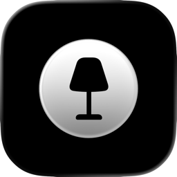
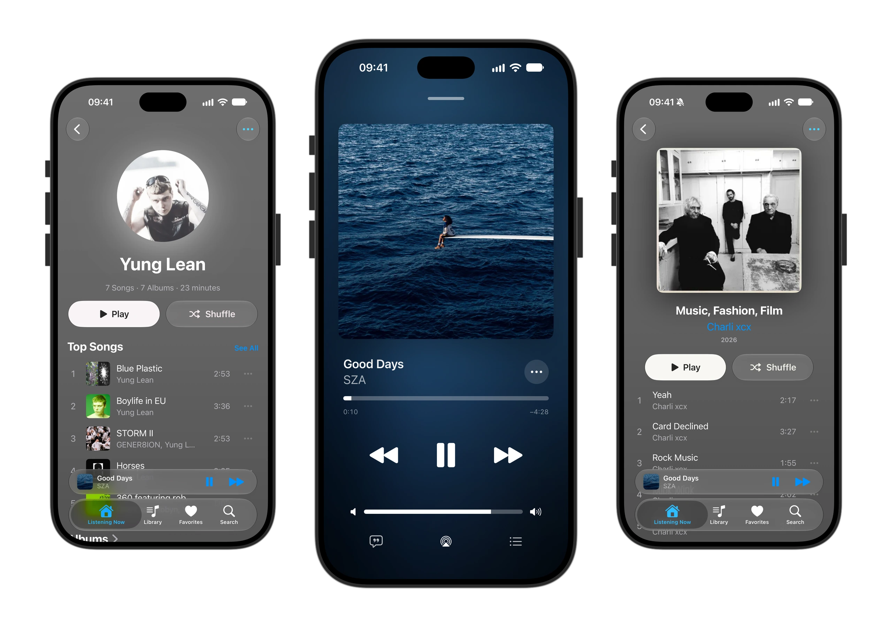

  

<b>Swing Music iOS Client</b>

<b><code>v1.0.0 Beta 10</code></b>

**
[Join the Beta](https://testflight.apple.com/join/68bWKBss) • <a href="https://github.com/sponsors/swingmx" target="_blank">Sponsor Us ❤️</a> • [Swing Music Docs](https://swingmx.com/guide/introduction.html) • [r/SwingMusicApp](https://www.reddit.com/r/SwingMusicApp)
**

##

This client application allows you to stream music on your iPhone and iPad from your Swing Music server.

### Features

Below is a list of the currently implemented features:

**Playback**
- Streaming with selectable audio quality (up to lossless)
- Queue with shuffle, repeat and autoplay
- Recently played in the queue
- Crossfade
- Sleep timer
- Equalizer (UI only for now)
- AirPlay
- Downloads for offline listening
- Listening history synced to your server

**Lyrics**
- Word-by-word synced lyrics with background vocals
- Lyrics fetched in the app, also when you're away from home
- Synced line-by-line lyrics as fallback
- Songwriter credits

**Library**
- Albums, Artists and Playlists view
- Folders view
- Favorites
- Mixes
- Add songs to playlists
- Search Tracks, Albums, Artists
- Explicit badges
- Artist bios and listening stats

**iPhone & iPad**
- iPad layout with landscape player and sidebar
- Widgets
- Live Activity and Lock Screen controls
- Swipe actions on songs
- Light and dark theme

**Connection**
- Works with Tailscale and custom domains
- Self-signed certificates supported
- Report a problem right from the app

More features will be implemented in the future.

### How to use

Install the app via [TestFlight](https://testflight.apple.com/join/68bWKBss). When you launch the app, enter your server address, username and password to log in.

### Thanks to

- [MeloX](https://github.com/youshen2/MeloX)
- [Apple Music-like Lyrics (AMLL)](https://github.com/Steve-xmh/applemusic-like-lyrics)
- [Spicy Lyrics](https://github.com/Spikerko/spicy-lyrics)
- [LDDC](https://github.com/chenmozhijin/LDDC)
- [LNPopupUI](https://github.com/LeoNatan/LNPopupUI)
- [LRCLIB](https://lrclib.net)
- [MusicBrainz](https://musicbrainz.org) & [Wikipedia](https://www.wikipedia.org)
