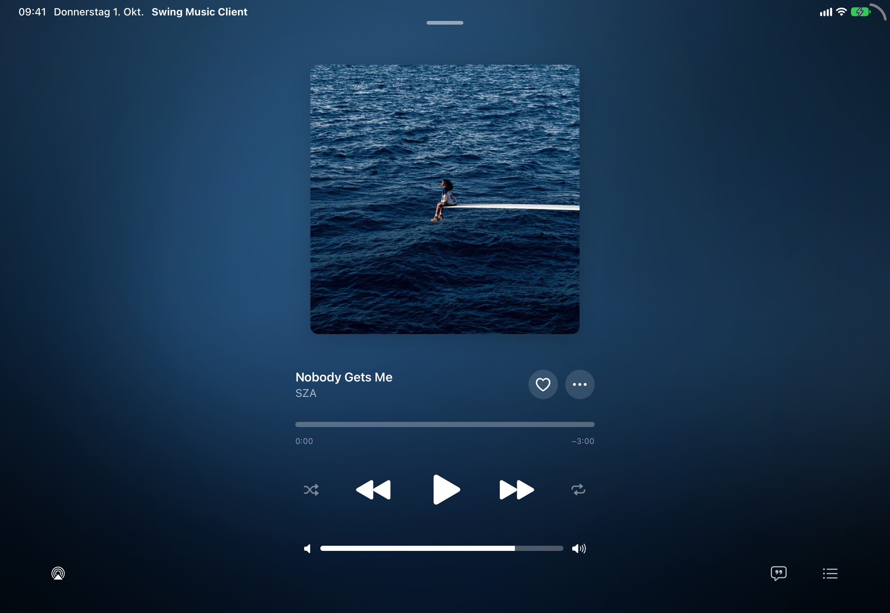
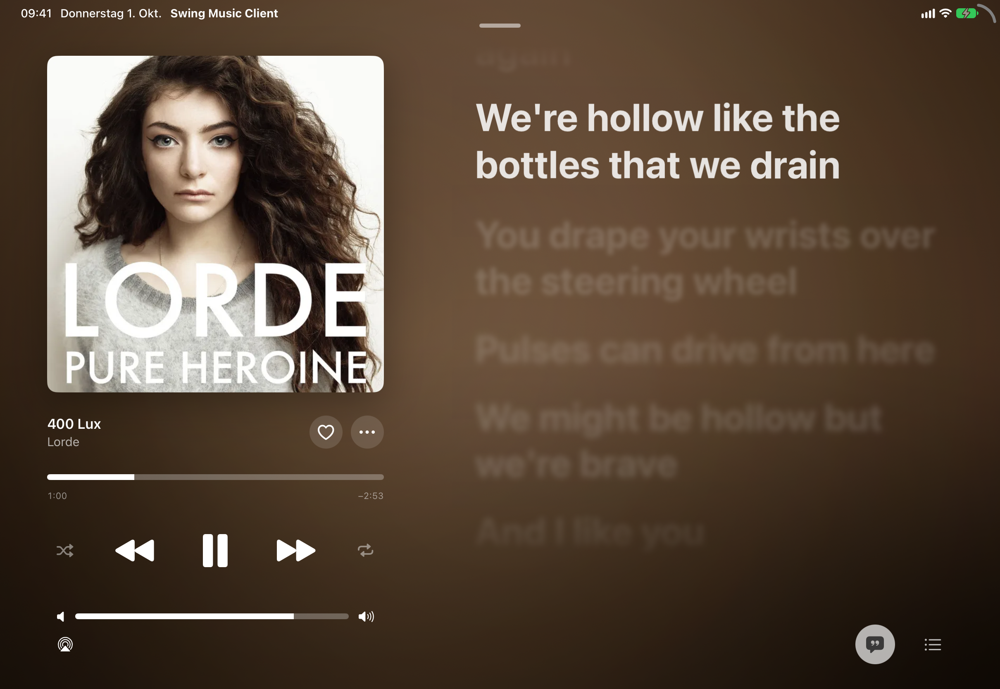

# Swing Music Client

A native iOS and iPadOS client for [Swing Music](https://github.com/swingmx/swingmusic), built with SwiftUI and the iOS 26 Liquid Glass design. Developed together with the Swing Music team.

> **Current release:** 1.0.0 Beta 10 (TestFlight)

<p align="center">
  
</p>

<p align="center">
  
</p>

<p align="center">
  
  
</p>

## Features

- **Word-by-word lyrics** with an Apple Music–style animation (native CALayer port of AMLL), including background vocals and songwriter credits
- **In-app lyrics fetching** from QQ Music, Kugou and NetEase (based on LDDC), with Musixmatch and LRCLIB as fallbacks
- **iPad layout**: landscape player with lyrics and queue next to the artwork, sidebar navigation
- **Streaming playback** that starts as soon as enough audio is buffered, plus offline downloads
- **AutoMix**: beat-aware crossfades between songs (needs the server extension below)
- **Queue**: Autoplay, Smart Shuffle and pull-to-reveal recently played
- **Library**: albums, artists and playlists, with native search
- **Artist pages**: About section from Wikipedia and listening stats
- **Widgets, Live Activities and Lock Screen controls**
- **Remote access**: Tailscale and custom domains supported, self-signed certificates optional

## Requirements

- iOS / iPadOS 26 or later
- Xcode 26 or later
- [XcodeGen](https://github.com/yonaskolb/XcodeGen) (`brew install xcodegen`)
- A running [Swing Music](https://github.com/swingmx/swingmusic) server

## Building

```bash
xcodegen generate
open SwingMusicApp.xcodeproj
```

Select your development team in *Signing & Capabilities* for both targets (`SwingMusic` and `SwingMusicWidgetsExtension`), then build and run.

## Server extensions

`server-extensions/automix` adds an analysis endpoint to Swing Music that the app uses for AutoMix transitions. It builds on top of the official Docker image:

```bash
cd server-extensions/automix
docker build -t swingmusic-automix .
```

Run this image instead of the regular `swingmusic` image. Without it, the app falls back to normal crossfades.

## Thanks to

- [MeloX](https://github.com/youshen2/MeloX): loose inspiration for the player
- [Apple Music-like Lyrics (AMLL)](https://github.com/Steve-xmh/applemusic-like-lyrics): inspiration for the lyrics animation
- [Spicy Lyrics](https://github.com/Spikerko/spicy-lyrics): lyrics style
- [LDDC](https://github.com/chenmozhijin/LDDC): word-by-word lyrics fetching (QQ Music, Kugou, NetEase)
- [LNPopupUI](https://github.com/LeoNatan/LNPopupUI): mini player
- [LRCLIB](https://lrclib.net): synced lyrics
- [MusicBrainz](https://musicbrainz.org) & [Wikipedia](https://www.wikipedia.org): songwriter credits and artist bios
